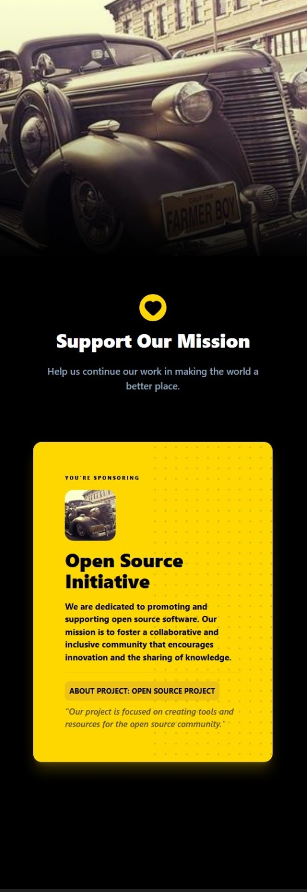
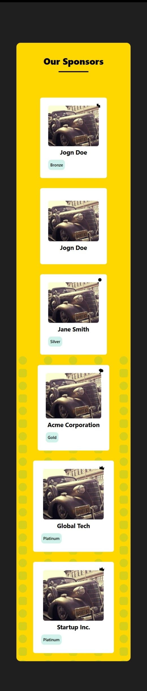
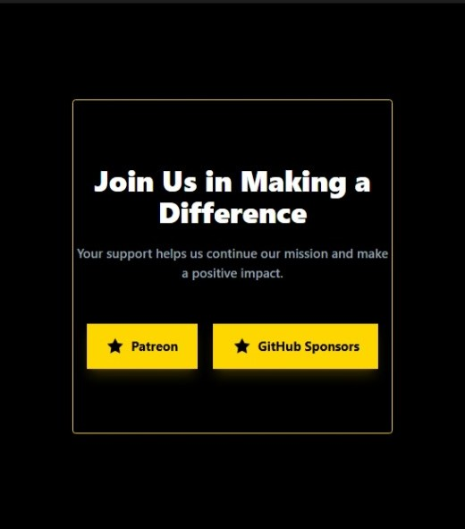
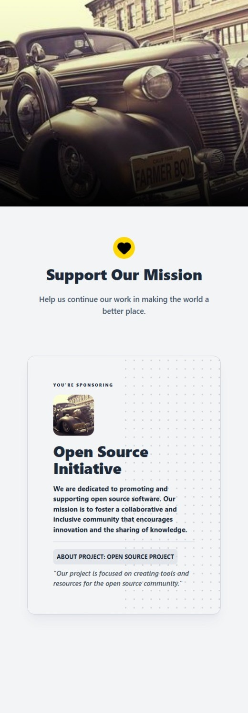
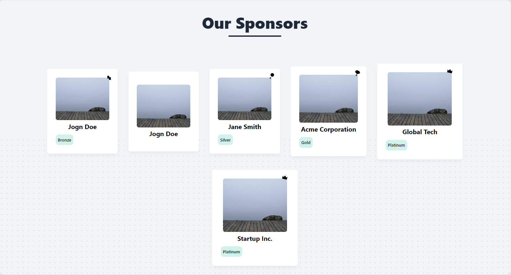
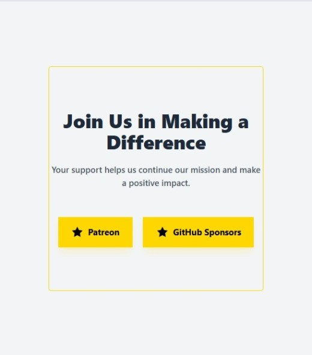
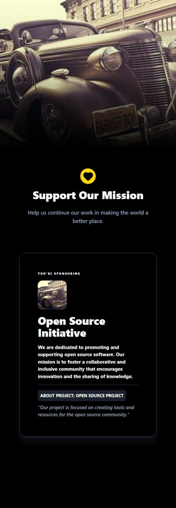
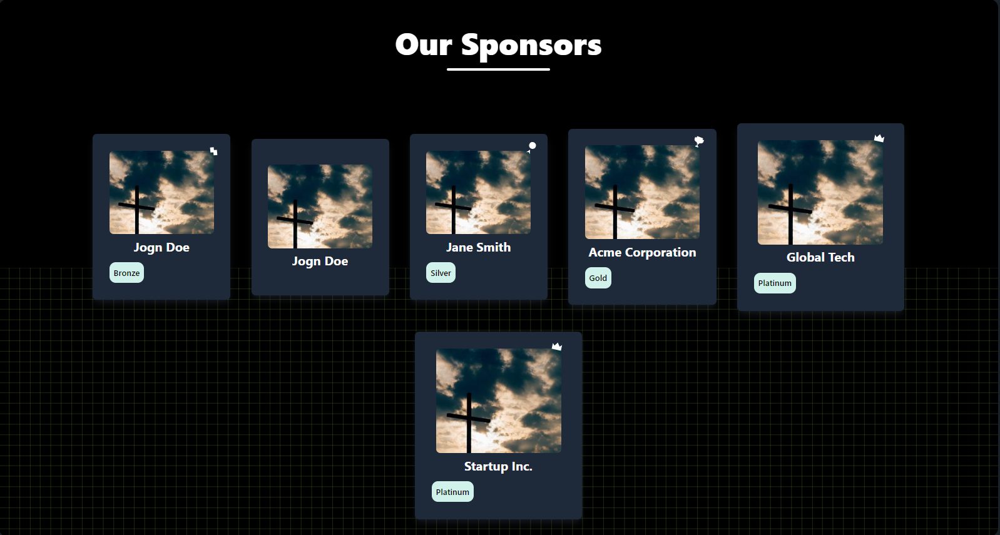
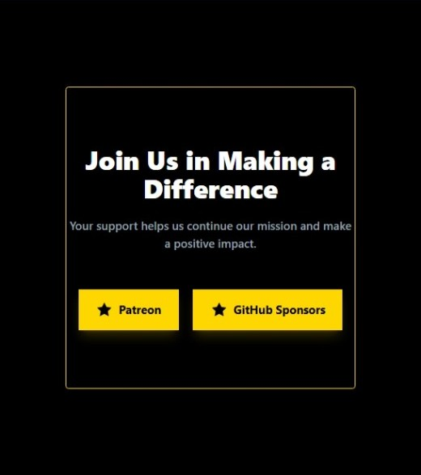

<!-- Don't delete it -->
<div name="readme-top"></div>

<!-- Organization Logo -->
<div align="center" style="display: flex; align-items: center; justify-content: center; gap: 16px;">
  
</div>

&nbsp;

<!-- Organization Name -->
<div align="center">

[](https://github.com/AOSSIE-Org/SupportUsButton)

<!-- Correct deployed url to be added -->

</div>

<!-- Organization/Project Social Handles -->
<p align="center">
<!-- Telegram -->
<a href="https://t.me/StabilityNexus">
</a>
&nbsp;&nbsp;
<!-- X (formerly Twitter) -->
<a href="https://x.com/aossie_org">
</a>
&nbsp;&nbsp;
<!-- Discord -->
<a href="https://discord.gg/hjUhu33uAn">
</a>
&nbsp;&nbsp;
<!-- Medium -->
<a href="https://news.stability.nexus/">
  </a>
&nbsp;&nbsp;
<!-- LinkedIn -->
<a href="https://www.linkedin.com/company/aossie/">
  </a>
&nbsp;&nbsp;
<!-- Youtube -->
<a href="https://www.youtube.com/@AOSSIE-Org">
  </a>
</p>

---

<div align="center">
<h1>SUPPORT US BUTTON</h1>
</div>

A lightweight React component library for displaying **Support us page** in a clean and customizable way. It provides pre-built UI components to showcase support us page with tier-based layouts, theme support, and Tailwind CSS styling, making it easy to integrate a professional support us page into any project or website.

---

# 🚀 Features

- **🎨 Tier-based Layouts**: Display sponsors in different tiers with logos and links, styled according to the selected theme.

- **🎨 Theme Support**: Choose from **light**, **dark**, **minimal**, **corporate**, or **AOSSIE** themes for consistent branding.

- **🎨 Customizable Styling**: Tailwind CSS classes for easy customization of the support us page.

- **🖥️ Responsive Design**: Built with responsive design principles for optimal viewing on all devices.

- **🧩 Easy Integration**: Simple to integrate into any project or website with a single component.

- **📦 ESM + CommonJS + UMD builds**: Supports various module systems for flexible integration.

- **🧠 TypeScript support included**: Provides type definitions for seamless development.

- **🎨 Styled with Tailwind (no global resets)**: Uses Tailwind CSS for styling with no global resets.

- **🪶 Lightweight and optimized**: Lightweight and optimized for performance.

---

# 💻 Tech Stack

**[React](https://react.dev/)** – For building reusable UI components

**[TypeScript](https://www.typescriptlang.org/)** – For type safety and better developer experience

**[Tailwind CSS](https://tailwindcss.com/)** – For modern, utility-first styling

**[Rollup](https://rollupjs.org/)** – For bundling and optimizing the package for distribution

**[Node.js](https://nodejs.org/) & [npm](https://www.npmjs.com/)** – For package management and publishing

---

# 🔗 Repository Links

- [Main Repository](https://github.com/AOSSIE-Org/SupportUsButton)
- [NPM Package](https://www.npmjs.com/package/@aossie/support-us-button)
- [CDN](https://cdn.jsdelivr.net/npm/@aossie/support-us-button@latest/dist/index.umd.js)

---

# Installation

You can install and use this package either through **npm** (recommended for Node.js projects) or directly via a **CDN**.

## Using npm

Install the package using npm:

```bash
# Install the package
npm install @aossie/support-us-button
```

## Using CDN

You can also use the component directly in the browser via a CDN:

```html
<script src="https://cdn.jsdelivr.net/npm/@aossie/support-us-button@latest/dist/index.umd.js"></script>
```

Once included, the component will be available to use in your project.

---

# Usage

## Using npm

```tsx
// Import the component in your project:
import SupportUsButton from "@aossie/support-us-button";

// Import the styles in your project:
import "@aossie/support-us-button/style.css";

// Import the types in your project:
import type { supportUsButtonProps } from "@aossie/support-us-button";

// Use the component in your project:
<SupportUsButton {...props} />; // props is an object of type supportUsButtonProps
```

## Using CDN

```html
<script src="https://cdn.jsdelivr.net/npm/@aossie/support-us-button@latest/dist/index.umd.js"></script>

// Import the styles in your project:
<link
    rel="stylesheet"
    href="https://cdn.jsdelivr.net/npm/@aossie/support-us-button@latest/dist/style.css"
/>

// Use the component in your project:
<SupportUsButton />
```

Once included, the component will be available to use in your project.

---

## Example Usage

Below is an example configuration for the `SupportUsButton` component.  
Replace the placeholder text (titles, descriptions, images, links, etc.) with your own project information.

```tsx
// Example props configuration for SupportUsButton
// Modify the values according to your project needs

const props: supportUsButtonProps = {
    // Theme of the widget (e.g., AOSSIE, light, dark, minimal)
    Theme: "AOSSIE",

    // Background pattern type (e.g., grid, dots)
    pattern: "grid",

    hero: {
        Image: {
            // Replace with your hero image
            src: "https://your-image-link.com/hero-image.png",
            alt: "Hero section image",
        },

        // Main title shown at the top of the widget
        title: "Your Title Here",

        // Short description about your project or mission
        description:
            "Write a brief description about your project, organization, or the purpose of sponsorship here.",

        // Label shown above the sponsors section
        sponsorLabel: "Your Sponsors",
    },

    organizationInformation: {
        // Name of your organization
        name: "Your Organization Name",

        // Short description about the organization
        description:
            "Describe your organization, its mission, and what it works on.",

        // Optional organization logo
        logo: {
            src: "https://your-image-link.com/logo.png",
            alt: "Organization Logo",
        },

        projectInformation: {
            // Name of the project that is being sponsored
            name: "Your Project Name",

            // Short description of the project
            description:
                "Provide a short description of the project that sponsors are supporting.",
        },
    },

    // List of sponsors
    sponsors: [
        {
            name: "Sponsor Name",
            logo: "https://your-image-link.com/sponsor-logo.png",
            link: "https://sponsor-website.com",

            // Optional tier: Bronze | Silver | Gold | Platinum
            sponsorshipTier: "Bronze",
        },
        {
            name: "Another Sponsor",
            logo: "https://your-image-link.com/sponsor-logo.png",
            link: "https://sponsor-website.com",
            sponsorshipTier: "Silver",
        },
        {
            name: "Company Name",
            logo: "https://your-image-link.com/company-logo.png",
            link: "https://company-website.com",
            sponsorshipTier: "Gold",
        },
    ],

    ctaSection: {
        // Call-to-action title
        title: "Support This Project",

        // Description encouraging users to sponsor the project
        description:
            "Explain why supporting your project matters and how people can help.",

        sponsorLink: [
            {
                // Platform name
                name: "Patreon",

                // Sponsorship link
                url: "https://www.patreon.com/yourproject",

                // Optional icon for the platform
                icon: (
                    <svg
                        xmlns="http://www.w3.org/2000/svg"
                        width="24"
                        height="24"
                    >
                        <path d="M0 0h24v24H0z" fill="none" />
                        <path d="M12 2l3.09 6.26L22 9.27l-5 4.87 1.18 6.88L12 17.77l-6.18 3.25L7 14.14 2 9.27l6.91-1.01L12 2z" />
                    </svg>
                ),

                // Optional custom class for styling
                className: "patreon-link",

                // Open link in a new tab
                newTab: true,
            },
            {
                name: "GitHub Sponsors",
                url: "https://github.com/sponsors/yourproject",
                icon: (
                    <svg
                        xmlns="http://www.w3.org/2000/svg"
                        width="24"
                        height="24"
                    >
                        <path d="M0 0h24v24H0z" fill="none" />
                        <path d="M12 2l3.09 6.26L22 9.27l-5 4.87 1.18 6.88L12 17.77l-6.18 3.25L7 14.14 2 9.27l6.91-1.01L12 2z" />
                    </svg>
                ),
                className: "github-sponsors-link",
                newTab: true,
            },
        ],
    },

    // Button styling variant
    buttonVariant: "AOSSIE",
};

// Component usage
<SupportUsButton {...props} />;
```

---

<h1>Props API</h1>

<details>
<summary> <strong> Show details </strong> </summary>

## Available API

| Prop                      | Type             | Required | Description                                                                                                    |
| ------------------------- | ---------------- | -------- | -------------------------------------------------------------------------------------------------------------- |
| `Theme`                   | string           | No       | Theme for the button, can be one of "AOSSIE", "light", "dark", "minimal", or "corporate"                       |
| `pattern`                 | string           | No       | Optional background pattern for the button, can be one of "dots", "grid", "AOSSIE", or "none"                 |
| `hero`                    | object           | Yes      | Information about the Hero section, including title, description, sponsor label, and optional background Image |
| `organizationInformation` | object           | Yes      | Information about the organization, including name, description, logo, and project information                 |
| `sponsors`                | array of objects | No       | List of current sponsors, each with name, optional logo, link, and sponsorship tier                            |
| `ctaSection`              | object           | Yes      | Information about the call-to-action section, including title, description, and sponsor links                  |
| `classNames`              | object           | No       | Optional additional CSS class for custom styling                                                               |
| `buttonVariant`           | string           | No       | Optional button variant for styling the call-to-action buttons                                                 |

</details>

---

# Prop Options Reference

<details>
<summary><strong>Show details</strong></summary>
All available options for configurable props in the component.

## Theme

<details>
<summary><strong>Show details</strong></summary>

Controls the overall visual appearance of the widget.

| Value       | Description                              |
| ----------- | ---------------------------------------- |
| `AOSSIE`    | Default theme styled for AOSSIE branding |
| `corporate` | Corporate styled layout                  |
| `dark`      | Dark mode UI                             |
| `light`     | Light mode UI                            |
| `minimal`   | Minimal clean design                     |

</details>

## Pattern

<details>
<summary><strong>Show details</strong></summary>

Adds a decorative background pattern to the hero section.

| Value    | Description               |
| -------- | ------------------------- |
| `AOSSIE` | Square and Circle pattern |
| `dots`   | Dot pattern background    |
| `grid`   | Subtle grid pattern       |
| `none`   | None                      |

</details>

## hero

<details>
<summary><strong>Show details</strong></summary>

Controls the top section of the widget.

| Value          | Type    | Required | Description                 |
| -------------- | ------- | -------- | --------------------------- |
| `Image`        | `Image` | No       | Background or hero image    |
| `title`        | string  | Yes      | Main heading                |
| `description`  | string  | Yes      | Hero description            |
| `sponsorLabel` | string  | No       | Label above sponsor section |

</details>

## Image

<details>
<summary><strong>Show details</strong></summary>

Used in hero images and organization logos.

| Value | Type   | Required | Description      |
| ----- | ------ | -------- | ---------------- |
| `src` | string | No       | Imag URl         |
| `alt` | string | No       | Alternative text |

</details>

## buttonVariant

<details>
<summary><strong>Show details</strong></summary>

Controls the styling of the call-to-action buttons.

| Value       | Description                |
| ----------- | -------------------------- |
| `AOSSIE`    | Default styled button      |
| `primary`   | Primary action button      |
| `secondary` | Secondary button style     |
| `ghost`     | Transparent minimal button |
| `gradient`  | Gradient styled button     |

</details>

## organizationInformation

<details>
<summary><strong>Show details</strong></summary>

Information about the organization and project.

| Value                | Type                 | Required | Description              |
| -------------------- | -------------------- | -------- | ------------------------ |
| `name`               | string               | Yes      | Organization name        |
| `description`        | string               | Yes      | Organization description |
| `logo`               | `Image` / string     | No       | Organization logo        |
| `projectInformation` | `projectInformation` | Yes      | Project details          |

</details>

## projectInformation

<details>
<summary><strong>Show details</strong></summary>

Details about the project being sponsored.

| Value         | Type   | Required | Description         |
| ------------- | ------ | -------- | ------------------- |
| `name`        | string | Yes      | Project name        |
| `description` | string | Yes      | Project description |

</details>

## sponsors

<details>
<summary><strong>Show details</strong></summary>

List of sponsors displayed in the widget.

| Value             | Type   | Required | Description     |
| ----------------- | ------ | -------- | --------------- |
| `name`            | string | Yes      | Sponsor name    |
| `logo`            | string | No       | Sponsor logo    |
| `link`            | string | No       | Sponsor website |
| `sponsorshipTier` | `Tier` | No       | Sponsor tier    |

</details>

## Tier

<details>
<summary><strong>Show details</strong></summary>

Used inside the sponsors array to visually differentiate sponsors.

| Value      | Description          |
| ---------- | -------------------- |
| `Platinum` | Highest tier sponsor |
| `Gold`     | High level sponsor   |
| `Silver`   | Mid level sponsor    |
| `Bronze`   | Entry level sponsor  |

</details>

## ctaSection

<details>
<summary><strong>Show details</strong></summary>

Call-to-action section encouraging sponsorship.

| Value         | Type            | Required | Description                   |
| ------------- | --------------- | -------- | ----------------------------- |
| `title`       | string          | Yes      | CTA title                     |
| `description` | string          | Yes      | CTA description               |
| `sponsorLink` | `sponsorLink[]` | Yes      | List of sponsorship platforms |

</details>

## sponsorLink

<details>
<summary><strong>Show details</strong></summary>

Platform links for sponsorship (Patreon, GitHub Sponsors, etc).

| Value       | Type      | Required | Description           |
| ----------- | --------- | -------- | --------------------- |
| `name`      | string    | Yes      | Platform name         |
| `url`       | string    | Yes      | Sponsorship URL       |
| `icon`      | ReactNode | No       | Icon for the platform |
| `className` | string    | No       | Custom CSS class      |
| `newTab`    | boolean   | No       | Open link in new tab  |

</details>

## classNames

<details>
<summary><strong>Show details</strong></summary>

Allows custom styling of different widget sections.

| Value                     | Description                  |
| ------------------------- | ---------------------------- |
| `container`               | Root container styling       |
| `Hero`                    | Hero section styling         |
| `organizationInformation` | Organization section styling |
| `sponsors`                | Sponsors section styling     |
| `ctaSection`              | CTA section styling          |

</details>

</details>

---

# 📱 App Screenshots

## AOSSIE-Theme

<details>
<summary><b>Show details</b></summary>

AOSSIE-Theme mobile screen preview.

<div style="width:fit-content; margin:auto; display:flex; flex-wrap:wrap; gap:12px; justify-content:center;">
  
  
  
</div>

</details>

## Light-Theme

<details>
<summary><b>Show details</b></summary>

Light-Theme mobile screen preview.

<div style="width:fit-content; margin:auto; display:flex; flex-wrap:wrap; gap:12px; justify-content:center;">
  
  
  
</div>

</details>

## Dark-Theme

<details>
<summary><b>Show details</b></summary>

Dark-Theme mobile screen preview.

<div style="width:fit-content; margin:auto; display:flex; flex-wrap:wrap; gap:12px; justify-content:center;">
  
  
  
</div>

</details>

---

## 🙌 Contributing

⭐ Don't forget to star this repository if you find it useful! ⭐

Thank you for considering contributing to this project! Contributions are highly appreciated and welcomed. To ensure smooth collaboration, please refer to our [Contribution Guidelines](./CONTRIBUTING.md).

---

## ✨ Maintainers

- [Rahul vyas](https://github.com/rahul-vyas-dev/)
- [Zahnentferner](https://github.com/Zahnentferner)

---

## 📍 License

This project is licensed under the GNU General Public License v3.0.
See the [LICENSE](LICENSE) file for details.

---

## 💪 Thanks To All Contributors

Thanks a lot for spending your time helping **SupportUsButton** grow. Keep rocking 🥂

[](https://github.com/AOSSIE-Org/SupportUsButton/graphs/contributors)

© 2026 AOSSIE
